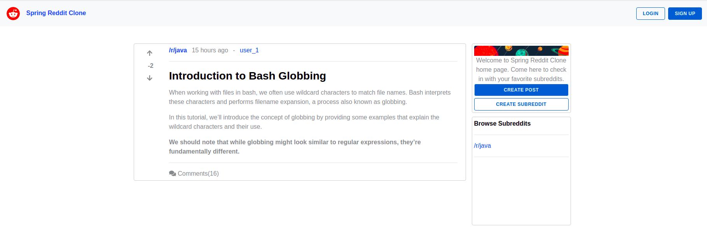
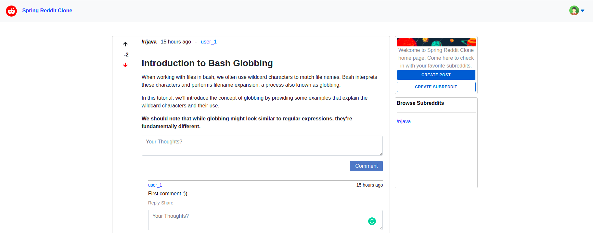

# CloneRedditFrontend

This project was generated with [Angular CLI](https://github.com/angular/angular-cli) version 11.0.2.

## About

This repo is based on the [tutorial](https://www.youtube.com/watch?v=7PsjGI-88sc&list=PLSVW22jAG8pAGrwFjsUERCu9WSo2-uEMg) on youtube.

This client uses api to connect to [server](https://github.com/dangngoctam00/clone-reddit).

## Demo images

Home page

After login, the user can create posts and subreddit, vote post, leave comments,...

